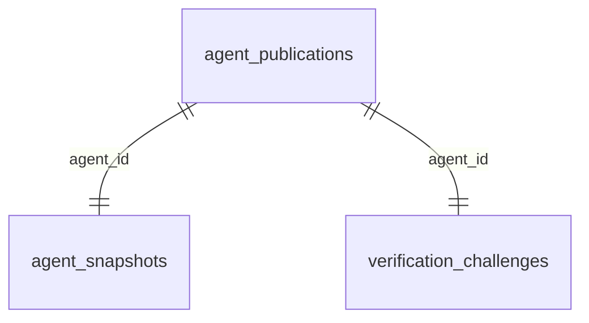

# Database Schema

Generated from `src/lib/db.ts`. Do not edit this file by hand; run `bun run docs:db-schema` after schema changes.

## Tables

### `agent_publications`

| Column | Type | Nullable | Key / Constraint | Notes |
| --- | --- | --- | --- | --- |
| `agent_id` | `text` | No | PK |  |
| `namespace` | `text` | No |  |  |
| `pending_owner_subject` | `text` | Yes |  |  |
| `source_url` | `text` | No |  |  |
| `access_url` | `text` | No |  |  |
| `access_mode` | `agent_access_mode` | No |  |  |
| `visibility` | `agent_visibility` | No |  |  |
| `status` | `publication_status` | No |  |  |
| `facts_ref_type` | `facts_ref_type` | Yes |  |  |
| `facts_ref_url` | `text` | Yes |  |  |
| `summary_provider` | `text` | Yes |  |  |
| `last_validated_at` | `timestamp with time zone` | Yes |  |  |
| `verified_at` | `timestamp with time zone` | Yes |  |  |
| `last_error` | `text` | Yes |  |  |
| `etag` | `text` | Yes |  |  |
| `created_at` | `timestamp with time zone` | No |  | default now() |
| `updated_at` | `timestamp with time zone` | No |  | default now() |

### `agent_snapshots`

| Column | Type | Nullable | Key / Constraint | Notes |
| --- | --- | --- | --- | --- |
| `agent_id` | `text` | No | PK; FK -> agent_publications.agent_id |  |
| `display_name` | `text` | No |  |  |
| `provider` | `text` | Yes |  |  |
| `skills` | `jsonb` | No |  | default '[]'::jsonb |
| `tags` | `jsonb` | No |  | default '[]'::jsonb |
| `supported_bindings` | `jsonb` | No |  | default '[]'::jsonb |
| `ttl_seconds` | `integer` | No |  |  |
| `updated_at` | `timestamp with time zone` | No |  | default now() |

### `namespaces`

| Column | Type | Nullable | Key / Constraint | Notes |
| --- | --- | --- | --- | --- |
| `namespace` | `text` | No | PK |  |
| `owner_subject` | `text` | No |  |  |
| `created_at` | `timestamp with time zone` | No |  | default now() |
| `updated_at` | `timestamp with time zone` | No |  | default now() |

### `verification_challenges`

| Column | Type | Nullable | Key / Constraint | Notes |
| --- | --- | --- | --- | --- |
| `agent_id` | `text` | No | PK; FK -> agent_publications.agent_id |  |
| `method` | `verification_method` | No |  |  |
| `url` | `text` | No |  |  |
| `token` | `text` | No |  |  |
| `expires_at` | `timestamp with time zone` | No |  |  |
| `created_at` | `timestamp with time zone` | No |  | default now() |
| `refreshed_at` | `timestamp with time zone` | No |  | default now() |

## Indexes

| Table | Index | Unique | Columns | Predicate |
| --- | --- | --- | --- | --- |
| `agent_publications` | `agent_publications_source_url_active_idx` | Yes | `source_url` | `"agent_publications"."status" = 'active'` |
| `verification_challenges` | `verification_challenges_token_idx` | Yes | `token` |  |

## Foreign Keys

| From Table | Columns | To Table | Columns | Constraint |
| --- | --- | --- | --- | --- |
| `agent_snapshots` | `agent_id` | `agent_publications` | `agent_id` | `agent_snapshots_agent_id_agent_publications_agent_id_fk` |
| `verification_challenges` | `agent_id` | `agent_publications` | `agent_id` | `verification_challenges_agent_id_agent_publications_agent_id_fk` |

## Enums

| Enum | Values |
| --- | --- |
| `agent_access_mode` | `public`, `protected` |
| `agent_visibility` | `public`, `restricted` |
| `facts_ref_type` | `public_url`, `brokered_url` |
| `publication_status` | `pending_verification`, `active`, `inactive`, `invalid` |
| `verification_method` | `well_known_token` |

## Relationships

## Notes

- `agent_publications.namespace` is a logical link to `namespaces.namespace`, but it is intentionally not enforced as a foreign key so pending pre-verification publications can exist before a namespace claim is finalized.
